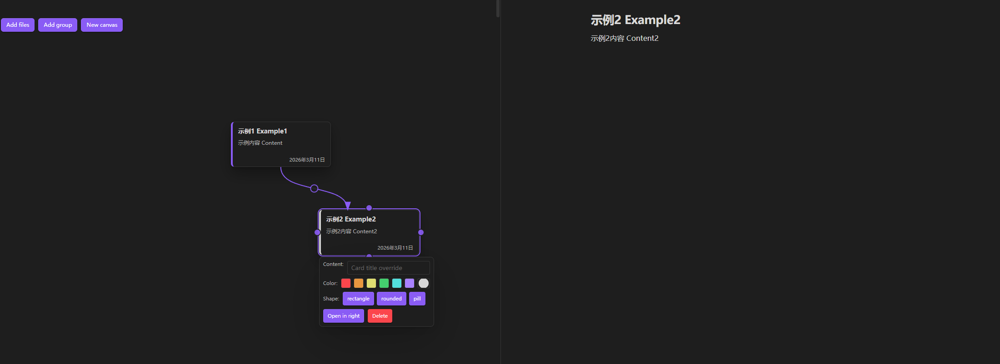

# Heinibal's Canvas File Manager 

这是一个canvas形式进行文件管理的插件，使用者可以通过card来管理所拥有的文件资产，构建其中的逻辑关系，并能轻易通过该canvas进行文件内容的更改。

This plugin creates a canvas that users can use to manage their file assets via cards, build logical relationships between them, and easily modify file content directly through the canvas.

> 特别针对非线性思维为主的用户。/ Specifically designed for users with non-linear thinking patterns.

## 使用方法 / How to Use

 - 创建或拖入文档。/ Create new documents or drag and drop existing ones.
 - 链接箭头。/ Connect cards using link arrows.
 - 单击文件以在右侧窗口进行编辑。/ Click on a file card to edit its content in the right-side panel.

